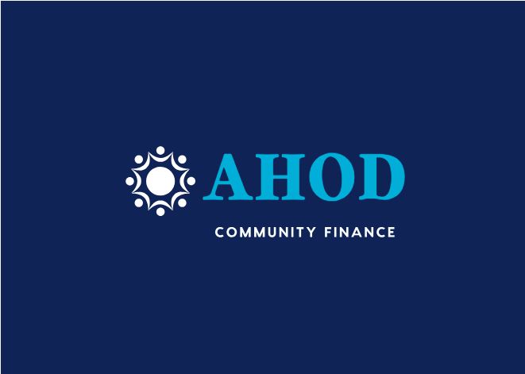

   ![][logo]

   [logo]: ./readme_imgs/logo.png "Product Logo"
   

By [Omar Azeemi](https://github.com/oazeemi), [Muatasim Qazi](https://github.com/muatasimqazi), 
[Alexis Lim](https://github.com/calim) & [Kidus Sendeke](https://github.com/Kidusyohanes)

## Description 
A website where group of students can come together to save money to pay off their student loans.

## Architecture

### Overall 
![Overall][arch]

[arch]: ./readme_imgs/architecture.png "Logo Title Text 2"

> **Community** 

> **Payment** 

> **Messaging**

## User stories 
|| Priority   | User  |  Description |  Technology |
|---|------------|---------|--------------| ---- |
|1| P0  | User  | as a creator, I want to create a community | Go REST API |
|2| P2  | User  | as a member, I want to join and exit a community | Go REST API |

### stratergires for implementation:
|num|strategies|
|-|-|
|1-2|for the first two user stories, we will use built in browser capabilities to either upload or record audio files and send them to the server/database. **HTML** to provide the UI for upload/record and upload the audio files to using the **JavaScript** by attaching to an **XMLHttpRequest**|

## APIs & Methods

| End point      | Method  |  Description |  Type     |  Service source       |
|----------------|---------|--------------|-----------|---------|
|**api.ahod.finance/v1/users/{id}**| GET, PATCH     | get or update user profile  | `Requires Log-in` | Gateway |
|**api.ahod.finance/v1/users**| POST, GET     | log-in to the website, Get searches for users | `Requires Log-in` | Gateway |
|**api.ahod.finance/v1/sessions**| GET     | looks for credentials and begins sessions | `Open` | Gateway |
|**api.ahod.finance/v1/sessions/**| DELETE     | ends current session | `Requires Log-in` | Gateway |

Endpoints for the Payment microservice are documented in the readme located in the servers/Payment folder

## **Tech Stack** 
#### Client Side 
* React
#### Server Side
> Microservices & APIs
* Golang
* Node
* Websockets
* RabbitMQ
> DB 
* MySql
* Redis

## Appendix
### Database Schema:

